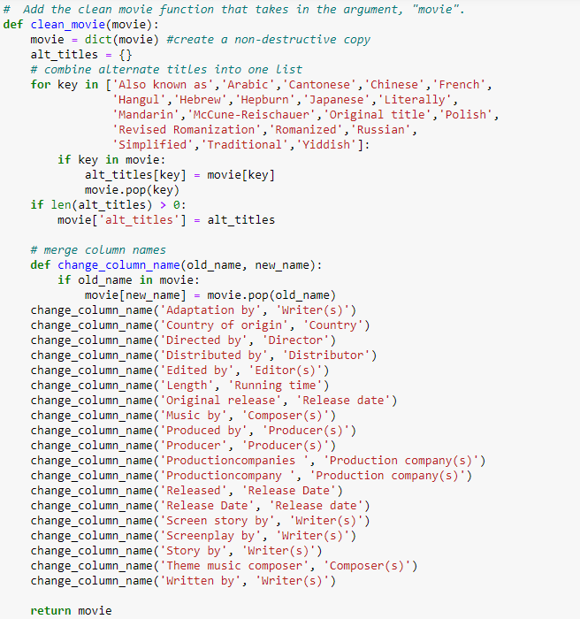
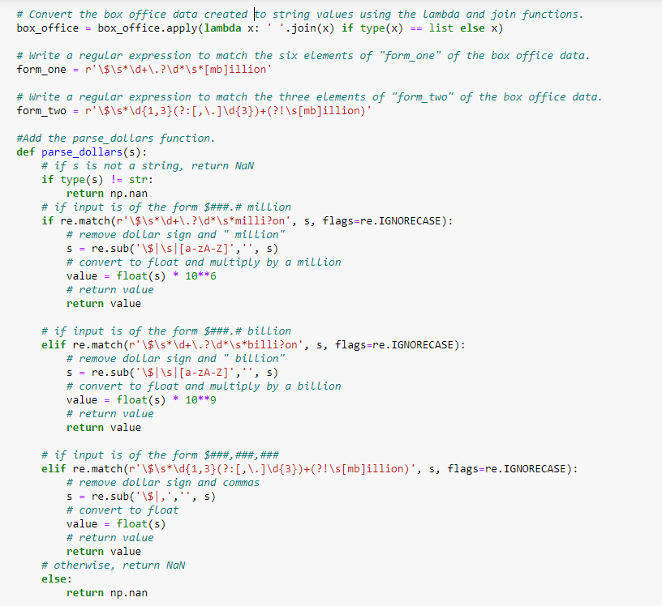
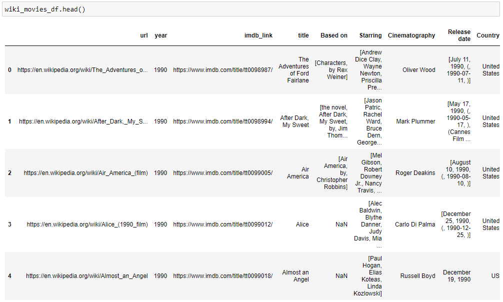
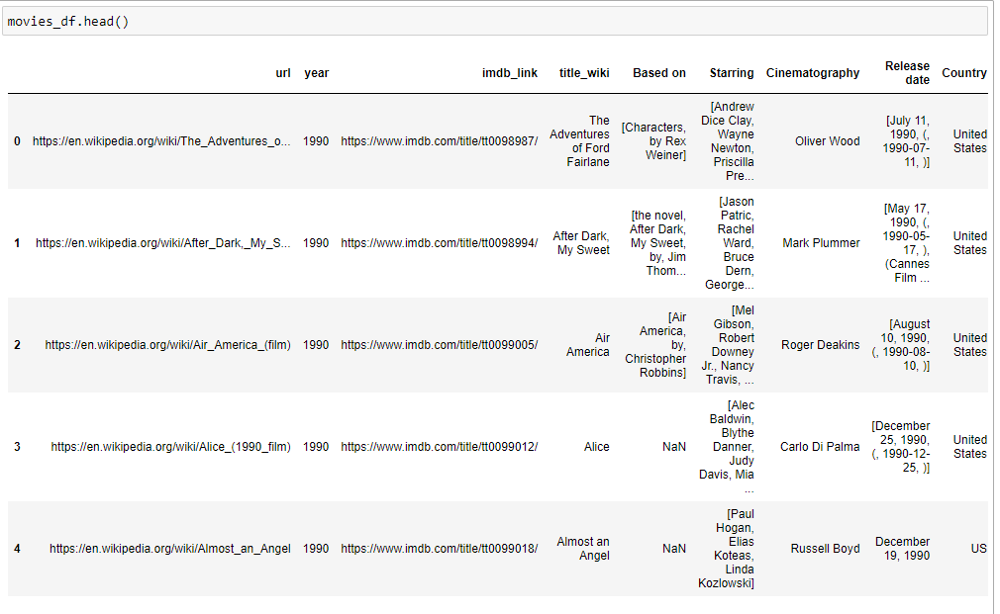
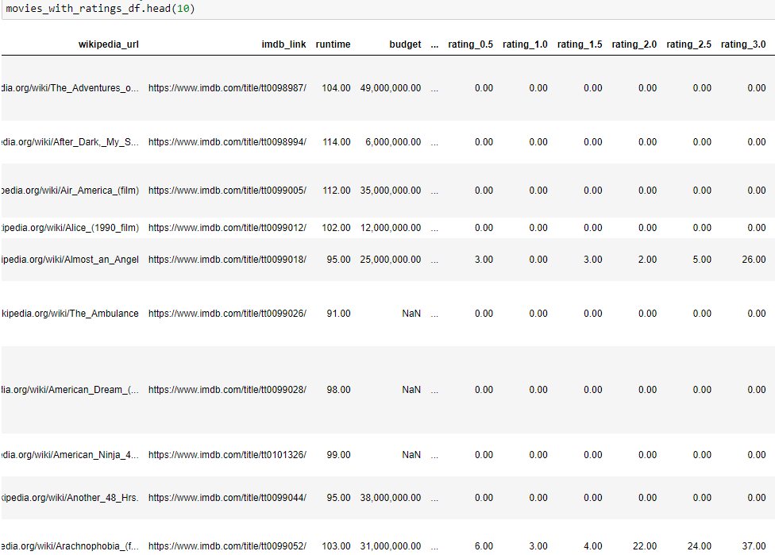

# Movies ETL
## Overview of the Project
In this project movie data was gathered from Wikipedia and Kaggle, cleaned and combined, and then and saved into a SQL database. In order to ensure clean, usable data was created, it was necessary to follow the ETL process: extract, transform and load.  Specifically, the Wikipedia and Kaggle data were extracted separately and had to be loaded using different methods.  Each was of the datasets was transformed by deleting or re-shaping the data and ultimately joining them together.  Finally, the cleaned dataset was loaded into a SQL database where it can be easily queried.  The idea behind ETL is straightforward. Raw data exists in multiple places and needs to be cleaned and structured before it can be analyzed. ETL breaks this problem into three steps, or phases: Extract, Transform, and Load.

## Coding Examples
A good deal of code was created in Python to perform the ETL on the movie data.  Below is an example of the code where alternative titles in the Wikipedia data set were combined to lessen the amount of columns in the overall data set.  Similar columns were grouped together to ultimately whittle down 193 columns of data to a much more manageable 23 columns of data.    

Some of the data of a given column was in different formats.  To standardize the data in a given column, regular expressions were used to sort through the data and tranform it into a standard, usable form.  In the code screenshot below, the box office amount each film generated was converted into a standard floating point number that can easily be used for calculations or graphing.  

## Data Table Examples
Three different tables were generated from the Wikipedia and Kaggle data.  Below is a screenshot of the initial Wikipedia data set before it was merged with the Kaggle data.

When the Wikipedia and Kaggle data were combined, they had several identical column data sets.  When they were merged, similar columns were marked as either coming from Wiki or Kaggle.  After merging, it had to be decided if one dataset was superior to the other or if the information from the two should be merged.  In most cases the Kaggle data was more descriptive and in a cleaner format.  However, overlapping Wiki data provided a useful way to fill in missing Kaggle data.  Below is a screen shot of a portion of the merged data: note the "title_wiki" column where all titles originated from Wikipedia and the "release_date_kaggle" where all the movie release date originated from Kaggle. 

